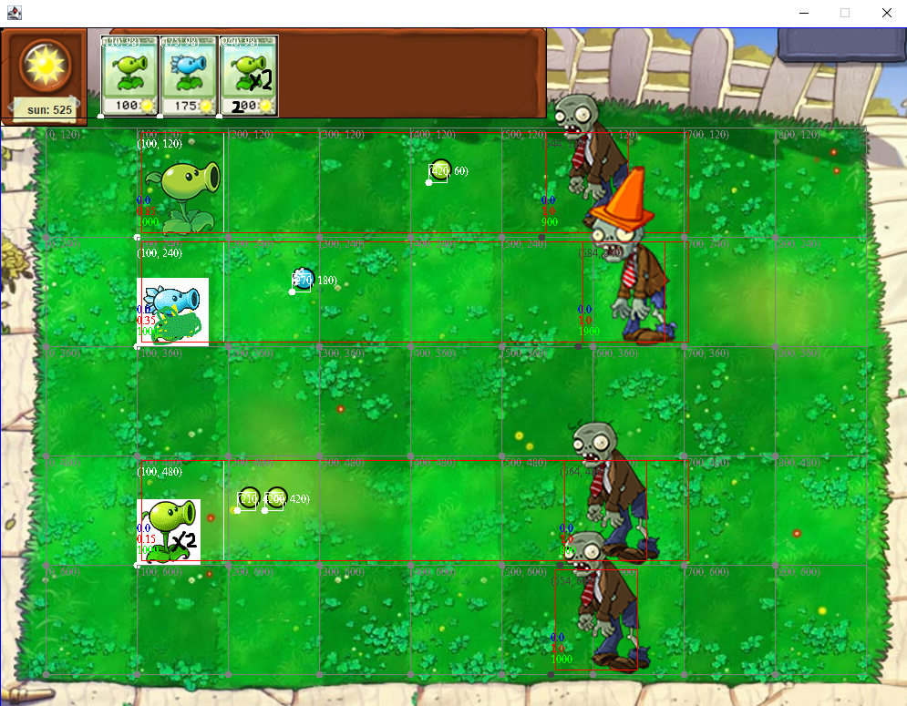

# PlantsVsZombies
My Own Clone of Plants VS Zombies Game Using Java

**项目正处于频繁更新阶段，故最新提交可能处于调试模式或存在bug甚至无法启动，且暂不提供稳定分支**

## 预期功能

提供一套Plants VS Zombies游戏流程框架和一套Mod框架，由Mod来实现游戏的UI，我方角色的行为、敌方角色的行为。

默认Mod即植物大战僵尸Mod：原游戏UI，我方角色为原游戏植物，敌方角色为原游戏僵尸。尽量还原Plants VS Zombies的行为。

新增明日方舟Mod作为自定义Mod的例子，可能包含（框架能力范围以内的）新的UI和行为方式（新的攻击范围、新的子弹类型、新的特殊能力...）。希望优先模仿明日方舟对应角色的属性，可能破坏原版Plants VS Zombies游戏平衡。

## 当前功能

- 支持注册多种植物并选择其中一部分出战

- 调试模式下的战场：显示地块网格、碰撞箱、攻击范围、血量和攻击冷却等

- 碰撞箱与图片分离，支持植物/僵尸高度超过一格

- 支持植物状态变化，例如土豆地雷的生长

- 支持发射不同状态的子弹和数次连射

